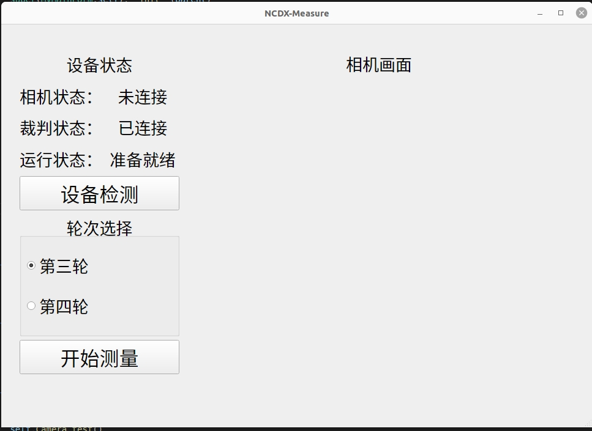

# An object measurement method based on BCNet

For copyright reasons, only part of the code is provided here,The main codes are from the website:https://github.com/lkeab/BCNet.

## Highlights

- **BCNet:** Two/one-stage (detect-then-segment) instance segmentation with state-of-the-art performance.
- **Novelty:** A new mask head design, explicit occlusion modeling with **bilayer decouple (object boundary and mask)** for the occluder and occludee in the same RoI.
- **Efficacy:** Large improvements both the FCOS (anchor-free) and Faster R-CNN (anchor-based) detectors.
- **Simple:** Small additional computation burden and easy to use.

Visualization of Occluded Objects
-----------------

<table>
    <tr>
        <td><center>


Qualitative instance segmentation results of our BCNet, using ResNet-101-FPN and Faster R-CNN detector. The bottom row visualizes squared heatmap of **object contour and mask predictions** by the two GCN layers for the occluder and occludee in **the same ROI region** specified by the red bounding box, which also makes the final segmentation result of BCNet more explainable than previous methods. The heatmap visualization of GCN-1 in fourth column example shows that **BCNet handles multiple occluders with in the same RoI by grouping them together**. See our paper for more visual examples and comparisons.
            </center></td>
        </tr>
</table>

Visualization of Occluded Bolts and Shims
-----------------

<table>
    <tr>
        <td><center>

The segmentation results of bolts and Shims using bcnet are shown in the figure,It can be seen that there is a good segmentation effect for occluded objects, which is the key to the next step of measurement
            </center></td>
        </tr>
</table>


Software Interface
-----------------

<table>
    <tr>
        <td><center>

The interface is shown in the figure. It displays the status of the program and can also detect the status of the equipment. The picture captured by the camera will be displayed in the blank on the right side of the interface
            </center></td>
        </tr>
</table>

Main Code Structure
-----------------

<table>
    <tr>
        <td><center>

The main code structure of the measurement part is shown in the figure above. Most of the codes are not provided on the website, so the project can not run smoothly directly. If you are interested in this, please contact me.
            </center></td>
        </tr>
</table>

## Step-by-step Installation

```
conda create -n bcnet python=3.7 -y
source activate bcnet
 
conda install pytorch==1.4.0 torchvision==0.5.0 cudatoolkit=10.1 -c pytorch
 
# FCOS and coco api and visualization dependencies
pip install ninja yacs cython matplotlib tqdm
pip install opencv-python==4.4.0.40
# Boundary dependency
pip install scikit-image
 
export INSTALL_DIR=$PWD
 
# install pycocotools. Please make sure you have installed cython.
cd $INSTALL_DIR
git clone https://github.com/cocodataset/cocoapi.git
cd cocoapi/PythonAPI
python setup.py build_ext install
 
# install BCNet
cd $INSTALL_DIR
git clone https://github.com/lkeab/BCNet.git
cd BCNet/
python3 setup.py build develop
 
unset INSTALL_DIR
```


## 